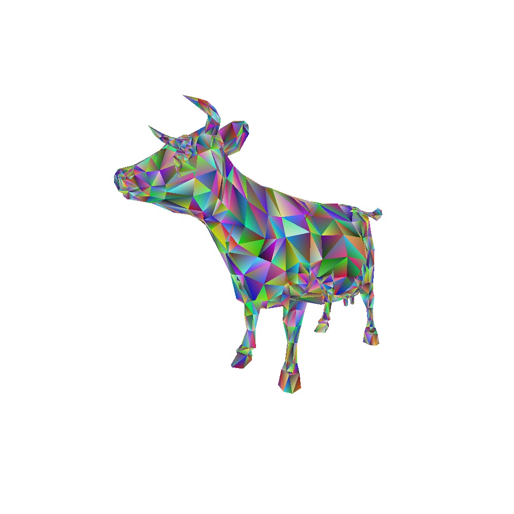

# rogue_rasterizer

A simple software rasterizer written for learning using this tutorial [Scratchapixel: Rasterization Practical Implementation](https://www.scratchapixel.com/lessons/3d-basic-rendering/rasterization-practical-implementation)

### Run

maxOS
```bash
# Usage: ./main <geo_file_path>
c++  -o main src/main.cpp -std=c++11 -O3
./main "data/cow.geo"
open output.ppm
```




### Todo

- [] Perspective correct vertex attribute interpolation (color)
- [] Import color from .obj files instead of assigning random colors
